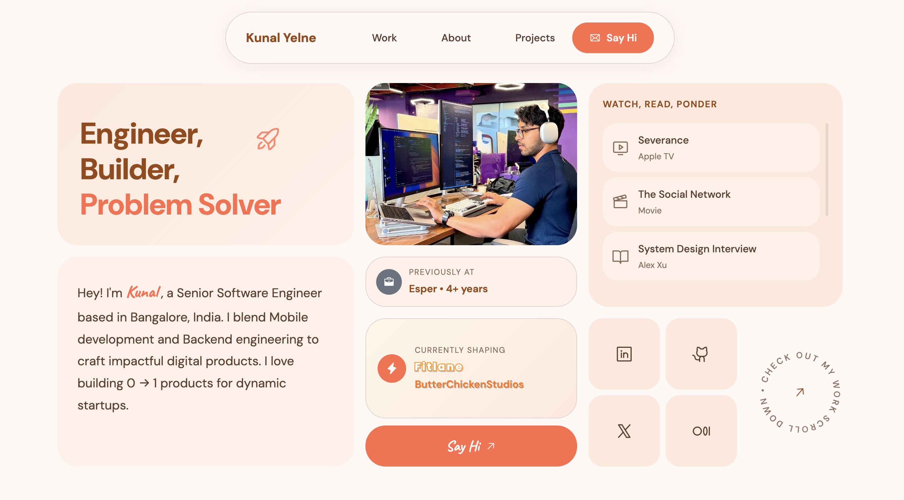

# Kunal Yelne | Senior Software Engineer

A professional portfolio showcasing 6+ years of experience in building high-scale mobile and backend systems. This site features a modern, responsive bento-grid design, a detailed professional timeline, and an interactive section for interests ("Watch, Read, Ponder").

## Preview

## Key Projects 🚀

- **Fitlane**: AI-powered fitness platform built with SwiftUI and Go microservices.
- **Butter Chicken Studios**: Software studio creating innovative mobile and industry solutions.
- **Enterprise MDM Platform**: Managed 1M+ Android/iOS devices across 50+ OEMs at Esper.
- **Face Recognition System**: Real-time security system built with Raspberry Pi and OpenCV.

## Tech Arsenal 🛠️

- **Mobile**: iOS (SwiftUI, UIKit), Android (Jetpack Compose, Kotlin), React Native.
- **Languages**: Go, Swift, Kotlin, Python, TypeScript, Java, C++.
- **Cloud & DevOps**: AWS, GCP, Docker, Kubernetes, Terraform, CI/CD.
- **Backend**: PostgreSQL, Redis, GraphQL, Microservices, RESTful APIs.

## About 📖

Senior Software Engineer based in Bangalore, India. I specialize in the intersection of mobile development and backend engineering, with a passion for building 0 → 1 products for dynamic startups.

## Links 🔗

- **Portfolio**: [https://kunalyelne.github.io](https://kunalyelne.github.io)
- **LinkedIn**: [kunalyelne](https://www.linkedin.com/in/kunalyelne)
- **GitHub**: [@kunalyelne](https://github.com/kunalyelne)
- **Medium**: [kunal_yelne](https://medium.com/@kunal_yelne)

---
Crafted with ❤️ and ☕ by Kunal Yelne.
